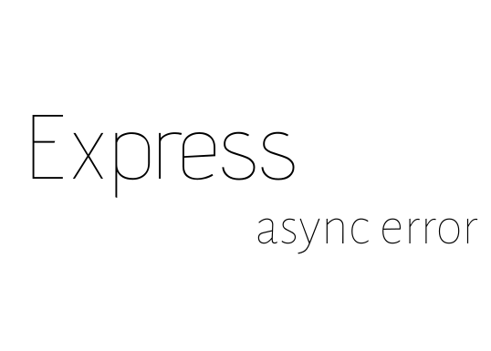

<h1 align="center">
       
    Rocketnotes API
</h1>

  

  

  
  
  
 
  

   

<h4 align="center"> 
	◌ Loading the application ◌
</h4>

 <a href="#-about">About</a> |
 <a href="#-how-it-works">How It Works</a> | 
 <a href="#-technologies">Technologies</a> | 
 <a href="#-author">Author</a> | 
 <a href="#-license">License</a>

## 💻 About

This is the repository for the backend of the Rocketnotes application, which works in conjunction with the corresponding frontend.

Rocketnotes is a web application that allows users to register and organize notes on various subjects in detail, including titles, descriptions, links and tags for each note. 

It also offers profile editing features, allowing users to change their avatar, name, e-mail address and password, among other features. 

It should be noted that this project is part of Rocketseat's Explorer trail/courses. 

## ⚙️ How it works

###  🔀 Routes

| Method | Route	| Description	| Parameters | Observations |
| --- | --- | --- | --- | --- |
| POST | /sessions | Returns the authentication data of an existing user | `email`, `password` | Send parameters in `body` | 
| GET	| /users	| Return a specific user	| `token` |	send `token` de authentication in `header` |
| POST | /users | Create a new user | `name`, `email`, `password` | send parameters in the `body` of the request |
| PUT | /users | Update a specific user | `token`, `name`, `email`, `password`, `newPassword`(optional) | send `token` in the `header` and the rest in the `body` |
| PATCH | /users/avatar | Update the avatar of a specific user | `token`, `avatar` | send `token` via `header` and the `avatar` in `multipart` format |
| GET | /notes | Return all notes for a user | `token` | send `token` authentication in `header` |
| GET | /notes:id | Return a specific note | `id`, `token` | send `token` by `header` and `id` by route |
| POST | /notes | Create a note | `title`, `description`, `tags`(array, optional), `links`(array, optional) | send `token` by `header` and the rest in `body` |
| DELETE | /notes/:id | Delete a specific note | `id`, `token` | send `token` via `header` and `id` via route |
| GET | /tags | Return tags created by a user | `token` | send authentication `token` in `header` |
| GET | /files/:filename | Returns avatar files | `filename` | send `filename` by route |

> Note: All parameters sent and received in the request and response body are in `JSON` format."
---

## 🛠 Technologies

The following tools were used in the construction of the project:

<code> Server: </code>  
<code></code>
<code></code>
<code></code>
<code></code>
<code></code>
<code></code>
<code></code>
<code></code>
<code></code>
<code></code>
<code></code>
<code></code>
<code></code>

> For more details of the application's general dependencies, see the file [package.json](./package.json)

## ✍ Author

## 📝 License

This project is under the MIT license. See the [LICENSE](./LICENSE) file for more information

Made with 💜 by Luiz Silva 👋🏽

 

